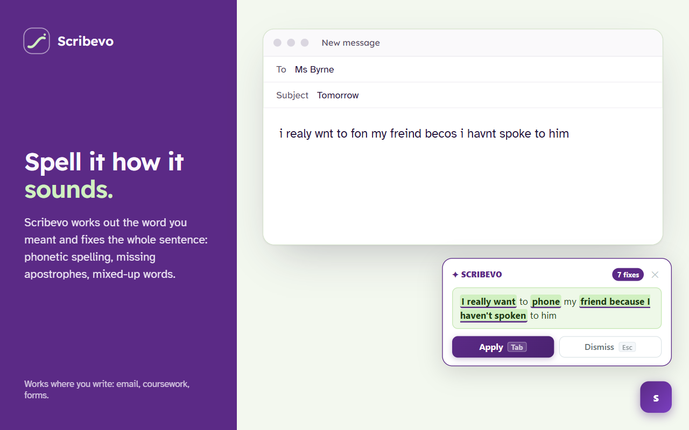
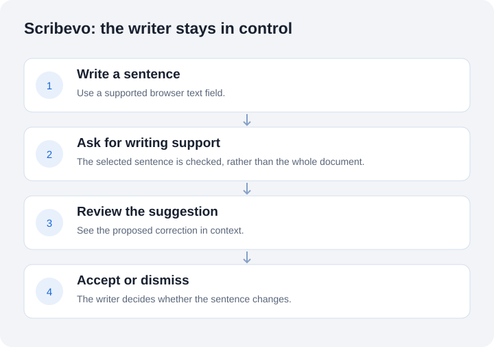

# Scribevo

**Writing help that understands how you spell.**

A Chrome extension by **Salem Elatrash**, developed from the **WordFlow** final-year research project at TU Dublin. Scribevo supports writers with dyslexia by suggesting sentence corrections they can review and accept.

[Try Scribevo on the Chrome Web Store](https://chromewebstore.google.com/detail/pfpakhloamdgoiokaljdfhpgkbanccci) · [Read the full case study](https://slooma951.github.io/portfolio/case-studies/scribevo.html)

## Project evidence: start here

| Inspect | What you can review |
| --- | --- |
| [Selected Python + NumPy code](examples/evaluate_edits.py) | Compare source, reference and output at token-edit level. |
| [Output](evidence/demo-output.json) | A runnable example and its saved JSON result, using synthetic data. |
| [Methodology and testing results](evidence/README.md) | **11 public-example tests pass**, checked 4 October 2026; provenance, commands and limits included. |

[NumPy analysis example](examples/analyse_outcomes.py): a new companion exercise, separate from the deployed extension.

*Prepared product example, not a universal correction guarantee.*

## The problem

A person can know what they want to say without knowing the expected spelling. Sound-based spelling, missing letters and swapped letters can make ordinary dictionary suggestions frustrating. Students then have to manage spelling alongside expressing their ideas.

## Why this matters now

About 1 in 10 people have dyslexia. [Dyslexia Ireland](https://dyslexia.ie/info-hub/about-dyslexia/what-is-dyslexia/).

AHEAD's 2023/24 report recorded 22,519 students registered with disability support services in Irish higher education, 8% of students. The largest category was specific learning difficulty, which includes dyslexia: 38.8%, or 8,738 students. [AHEAD, 2023/24 report](https://www.ahead.ie/userfiles/files/shop/free/AHEAD%20Participation%20Rates%2023-24_digital.pdf).

Many of these students rely on Grammarly. It now includes generative AI tools such as a paraphraser, citation finder and AI grader. [Wonkhe, October 2025](https://wonkhe.com/wonk-corner/some-reasonable-adjustments-may-have-just-become-academic-misconduct/).

Some universities now treat Grammarly as generative AI. Since August 2024, Notre Dame's honour code has included editing tools like Grammarly when a lecturer bans generative AI. A University of North Georgia student was put on academic probation in 2024 after using Grammarly on an essay. [Inside Higher Ed, November 2024](https://www.insidehighered.com/news/tech-innovation/artificial-intelligence/2024/11/26/grammarly-ai-notre-dame-says-yes). [FOX 5 Atlanta](https://www.fox5atlanta.com/news/grammarly-georgia-college-student-academic-probation-plagiarism-allegations).

This creates a risk for disabled students: a support plan permitting Grammarly may date from its spell-checking role. A student with dyslexia could follow that plan while breaking the AI rules. [Wonkhe, October 2025](https://wonkhe.com/wonk-corner/some-reasonable-adjustments-may-have-just-become-academic-misconduct/).

Scribevo corrects the sentence the writer has already written. It handles dyslexic spellings such as fone, becos and freind, plus apostrophes and common grammar slips. It does not write, paraphrase, add ideas or change the writer's style. Nothing changes until the writer accepts the correction. The words stay theirs.

The live version uses a rule layer first, then an AI model limited to sentence correction. The “Rules only, no AI” setting is built and tested but has not been released. Scribevo still uses AI today.

The aim is a tool a disability service could name in a student's support plan because it corrects rather than generates writing. No university has approved Scribevo yet.

Project check, 4 October 2026: live on the Chrome Web Store at version 2.0.0; 244 backend and 67 extension tests pass.

## What it does

- Suggests sentence corrections in supported browser text fields.
- Handles phonetic spellings, missing or swapped letters, apostrophes and some grammar errors.
- Shows the proposed change before the writer accepts it.
- Offers a dictionary searchable by an approximate spelling.
- Provides controls to pause help globally or on a particular site.

> Illustrative example: `i realy wnt to fon my freind` → `I really want to phone my friend.`
>
> This is a prepared example, not a universal accuracy claim.

## My contribution

I developed the original WordFlow research prototype, prepared a 6,571-pair training dataset, worked with a T5-based model using PyTorch and Hugging Face Transformers, and connected it to a JavaScript extension and a Python FastAPI service. Four participant sessions informed the prototype work.

The later Scribevo product uses a rule layer with AI-assisted correction. Its implementation has evolved beyond the original T5 prototype. AI coding assistance was used during later engineering and verification work.

## Evidence and current status

| Evidence | Scope and limits |
| --- | --- |
| Published extension | Project check, 4 October 2026: **Scribevo v2.0.0** is live on the Chrome Web Store. |
| Reported release checks | Project check, 4 October 2026: **244 backend + 67 extension tests pass**. This does not establish support for every browser editor. |
| Rules-only evaluation | **70/70 already-correct sentences preserved**; **3% harmful edits** on a separate 200-example held-out set. The provider-assisted stage was not evaluated in this run. |
| Research history | 6,571 training pairs and four participant sessions belong to the academic prototype. Original training and participant work were not rerun in the fresh check. |

## Why it matters

The intended benefit is helping students express an idea with less spelling friction while retaining control over the wording. Improved grades or learning outcomes have not been demonstrated by the current evaluation. More participant work is needed.

## High-level engineering

Browser interface → sentence check → reviewable suggestion → accept or dismiss.

**Technologies:** JavaScript, Chrome Manifest V3, Python, FastAPI; PyTorch and Hugging Face Transformers in the research prototype.

The emphasis is on reviewable edits, measurement of harmful changes and clear differences between research results and current product behaviour.

## Privacy and limitations

The published listing says the AI stage processes the sentence through **Groq in the United States**. No account is required. Cloud processing is a meaningful trade-off; read the [product privacy policy](https://slooma951.github.io/projectweb/scribevo/privacy.html).

Context-dependent tense remains difficult. Editor behaviour varies, and automated tests do not replace real-site checks. No universal correction guarantee is made.

## About this repository

This is a **public project showcase**, not the product source repository. It contains selected evaluation code, tests, evidence, an explanation, a prepared product screenshot and an original conceptual diagram. Correction rules, model code, datasets, trained artefacts, credentials, endpoint configuration and implementation history are excluded.

Public descriptions demonstrate the work but cannot prevent independent implementation of a similar idea. No licence to the private implementation is granted by this showcase.

This public showcase is archived as a portfolio snapshot with selected code and reproducible evidence. Archiving applies to this presentation repository; product development is maintained separately in private.
